# 🛒 Final Project Teknologi Komputasi Awan 2026 — Kelompok A3

## Order Processing Service

Sebuah layanan backend **Order Processing Service** yang di-deploy pada infrastruktur cloud **DigitalOcean**, dirancang untuk menangani lonjakan traffic (flash sale, promo, dsb.) dengan andal dan efisien.

> **Mata Kuliah:** Teknologi Komputasi Awan (TKA) — Semester 4, 2026
> **Kelompok:** A3
> **Cloud Provider:** DigitalOcean (Budget: $75/bulan)
> **URL Akses:** [`http://129.212.209.53`](http://129.212.209.53)

# KELOMPOK 4 KELAS A

| Nama | NRP |
| :--- | :--- |
| Evan Christian Nainggolan | 5027241026 |
| Rizqi Akbar Sukirman P. | 5027241044 |
| Dina Rahmadani | 5027241065 |
| M. Hikari Reiziq | 5027241079 |
| Ahmad Syawqi Reza | 5027241085 |
| Yasykur Khalis Jati | 5027241112 |

---

## 📑 Daftar Isi

1. [Introduction](#1-introduction)
2. [Arsitektur Cloud](#2-arsitektur-cloud)
3. [Implementasi](#3-implementasi)
4. [Hasil Pengujian Endpoint](#4-hasil-pengujian-endpoint)
5. [Hasil Load Testing](#5-hasil-load-testing)
6. [Kesimpulan dan Saran](#6-kesimpulan-dan-saran)

---

## 1. Introduction

### 1.1 Latar Belakang

Sebuah perusahaan rintisan (startup) di bidang e-commerce sedang mengembangkan platform jual-beli online. Platform ini membutuhkan backend **Order Processing Service** — layanan inti yang menangani:

- **Pembuatan pesanan** (order creation)
- **Pengecekan status pesanan** (order tracking)
- **Riwayat transaksi** (order history)
- **Katalog produk** (product catalog)
- **Dashboard admin** (admin statistics)

Sebagai Cloud Engineer, kami diminta untuk **mendeploy, mengonfigurasi, dan mengoptimalkan** layanan tersebut agar mampu menerima **request per second (RPS) setinggi mungkin** dalam batas budget **$75/bulan**.

### 1.2 Teknologi yang Digunakan

| Komponen | Teknologi |
|----------|-----------|
| Backend Framework | Python (Flask) |
| WSGI Server | Gunicorn (mode `gthread`, 4 workers × 20 threads) |
| Database | MongoDB 7.x |
| Reverse Proxy | Nginx |
| Load Balancer | DigitalOcean Managed Load Balancer |
| Frontend | HTML5 + CSS3 + Vanilla JavaScript |
| Authentication | JWT (JSON Web Token) |
| Password Hashing | bcrypt |
| Load Testing | Locust (FastHttpUser) |

### 1.3 Akun Default

| Role | Email | Password |
|------|-------|----------|
| Admin | `admin1@tka.its.ac.id` | `Admin@12345` |
| Admin | `admin2@tka.its.ac.id` | `Admin@12345` |
| User | `user1@example.com` s/d `user500@example.com` | `User@12345` |

---

## 2. Arsitektur Cloud

### 2.1 Diagram Arsitektur

```
                 ┌───────────────────────────────────┐
                 │         Internet / Client          │
                 └───────────────┬───────────────────┘
                                 │
                 ┌───────────────▼───────────────────┐
                 │        Load Balancer               │
                 │        129.212.209.53              │
                 │        DigitalOcean LB             │
                 │        $12/bulan                   │
                 └──┬──────────┬──────────┬──────────┘
                    │          │          │
       ┌────────────▼──┐  ┌───▼────────────┐  ┌───▼────────────┐
       │   Worker-1    │  │   Worker-2     │  │   Worker-3     │
       │  168.144.45.x │  │ 168.144.136.x  │  │ 152.42.191.x   │
       │  1vCPU / 2GB  │  │  1vCPU / 2GB   │  │  1vCPU / 2GB   │
       │  $12/bulan    │  │  $12/bulan     │  │  $12/bulan     │
       │               │  │                │  │                │
       │  ┌──────────┐ │  │  ┌──────────┐  │  │  ┌──────────┐  │
       │  │  Nginx   │ │  │  │  Nginx   │  │  │  │  Nginx   │  │
       │  │(Frontend │ │  │  │(Frontend │  │  │  │(Frontend │  │
       │  │ + Proxy) │ │  │  │ + Proxy) │  │  │  │ + Proxy) │  │
       │  └────┬─────┘ │  │  └────┬─────┘  │  │  └────┬─────┘  │
       │       │        │  │       │        │  │       │        │
       │  ┌────▼─────┐  │  │  ┌────▼─────┐  │  │  ┌────▼─────┐  │
       │  │ Gunicorn │  │  │  │ Gunicorn │  │  │  │ Gunicorn │  │
       │  │ (Flask)  │  │  │  │ (Flask)  │  │  │  │ (Flask)  │  │
       │  │ 4w × 20t │  │  │  │ 4w × 20t │  │  │  │ 4w × 20t │  │
       │  └──────────┘  │  │  └──────────┘  │  │  └──────────┘  │
       └───────┬────────┘  └───────┬────────┘  └───────┬────────┘
               │                   │                   │
               └───────────────────┼───────────────────┘
                                   │ (VPC Private Network)
                    ┌──────────────▼───────────────┐
                    │         db-mongo              │
                    │        68.183.185.x           │
                    │        2vCPU / 4GB RAM         │
                    │        MongoDB 7.x            │
                    │        $24/bulan              │
                    └──────────────────────────────┘
```

### 2.2 Tabel Spesifikasi & Biaya

| No | Komponen | Hostname | Spesifikasi | Region | Harga/bulan |
|----|----------|----------|-------------|--------|-------------|
| 1 | Load Balancer | `load-balancer` | DigitalOcean Managed LB | SGP1 | $12 |
| 2 | App Server 1 | `worker-1` | 1vCPU, 2 GB RAM, 50 GB SSD | SGP1 | $12 |
| 3 | App Server 2 | `worker-2` | 1vCPU, 2 GB RAM, 50 GB SSD | SGP1 | $12 |
| 4 | App Server 3 | `worker-3` | 1vCPU, 2 GB RAM, 50 GB SSD | SGP1 | $12 |
| 5 | Database Server | `db-mongo` | 2vCPU, 4 GB RAM, 80 GB SSD | SGP1 | $24 |
| | | | | **Total** | **$72/bulan** |

> **Budget Utilization:** $72 / $75 = **96%** — Sangat efisien, hanya menyisakan $3 sebagai buffer.

### 2.3 Justifikasi Pemilihan Arsitektur

| Keputusan Desain | Alasan |
|------------------|--------|
| **3 Worker + 1 Load Balancer** | Memaksimalkan throughput. 3 Worker memberikan total ~159 RPS (~53 RPS per worker). Load Balancer mendistribusikan beban secara merata (round-robin). |
| **Worker 2GB RAM** | Gunicorn mode `gthread` (4 workers × 20 threads) membutuhkan ~1.2GB RAM. Sisa RAM digunakan OS dan Nginx. Spesifikasi 1GB terlalu kecil dan menyebabkan OOM (Out of Memory). |
| **Database 4GB RAM terpisah** | MongoDB menggunakan WiredTiger Storage Engine yang sangat agresif memanfaatkan RAM untuk in-memory caching. Dengan 4GB, seluruh index + working set data masuk dalam RAM. Memisahkan DB dari app server menghindari persaingan resource CPU/RAM. |
| **Region SGP1** | Singapore adalah region DigitalOcean terdekat dari Indonesia. Semua komponen di region yang sama meminimalkan network latency (<1ms antar-node). |
| **Frontend via Nginx (bukan DO Spaces)** | DigitalOcean Spaces menggunakan HTTPS secara paksa, sedangkan Backend API kita menggunakan HTTP biasa. Ini menyebabkan **Mixed Content Error** di browser modern. Dengan menaruh Frontend di Nginx yang sama dengan Backend (same-origin), masalah ini terselesaikan sepenuhnya. |

---

## 3. Implementasi

Panduan ini ditulis secara detail agar siapa saja — termasuk yang baru pertama kali menggunakan cloud — dapat mengikuti langkah-langkahnya dari awal hingga akhir.

### Prasyarat

Sebelum memulai, pastikan kamu punya:
- Akun DigitalOcean dengan credit tersedia (minimal $75)
- Terminal SSH (Windows: WSL / PowerShell, macOS/Linux: Terminal bawaan)
- Git terinstall di komputer lokal
- Python 3 dan `pip` terinstall di komputer lokal (untuk menjalankan Locust)

---

### 3.1 Setup Database Server (MongoDB)

#### Buat Droplet di DigitalOcean

1. Login ke [DigitalOcean Dashboard](https://cloud.digitalocean.com/)
2. Klik **Create** → **Droplets**
3. Isi konfigurasi berikut:
   - **Image:** Ubuntu 22.04 LTS
   - **Plan:** Regular → **2 vCPU / 4 GB RAM** ($24/mo)
   - **Region:** Singapore (SGP1)
   - **Authentication:** SSH Key (direkomendasikan) atau Password
   - **Hostname:** `db-mongo`
4. Klik **Create Droplet**
5. Catat **IP Address** droplet yang muncul

#### Install MongoDB

SSH ke droplet database:

```bash
ssh root@<IP_DB_MONGO>
```

Jalankan perintah berikut satu per satu:

```bash
# 1. Tambahkan repository MongoDB 7.0
curl -fsSL https://www.mongodb.org/static/pgp/server-7.0.asc | \
  gpg --dearmor -o /usr/share/keyrings/mongodb-server-7.0.gpg

echo "deb [ signed-by=/usr/share/keyrings/mongodb-server-7.0.gpg ] \
  https://repo.mongodb.org/apt/ubuntu jammy/mongodb-org/7.0 multiverse" | \
  tee /etc/apt/sources.list.d/mongodb-org-7.0.list

# 2. Install MongoDB
apt update && apt install -y mongodb-org

# 3. Konfigurasi agar MongoDB menerima koneksi dari Worker
sed -i 's/bindIp: 127.0.0.1/bindIp: 0.0.0.0/' /etc/mongod.conf

# 4. Start dan enable MongoDB
systemctl start mongod
systemctl enable mongod

# 5. Verifikasi MongoDB berjalan
systemctl status mongod
```

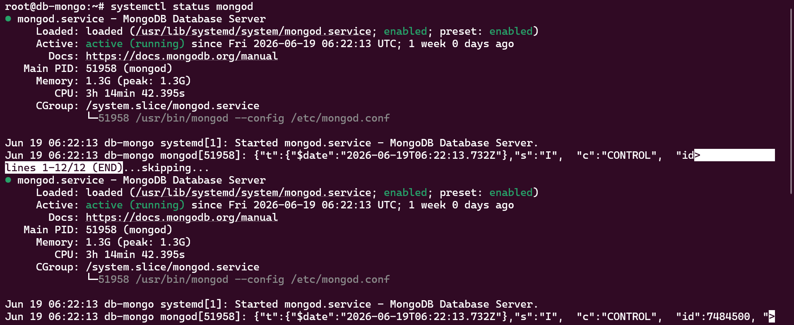

**Gambar 1.** Status layanan MongoDB.

#### Konfigurasi MongoDB

```yaml
net:
  port: 27017
  bindIp: 0.0.0.0
```

#### Restore Data Awal (Seed Data)

```bash
# Install tools untuk restore
apt install -y mongodb-database-tools

# Upload folder dump dari komputer lokal ke server:
# (Jalankan dari komputer lokal, BUKAN dari server)
# scp -r Resources/DB/dump/ root@<IP_DB_MONGO>:/root/

# Di server, restore data:
mongorestore --drop /root/dump/
```

Data awal yang di-restore:

| Collection | Dokumen | Keterangan |
|------------|---------|------------|
| users | 505 | 5 admin + 500 user biasa |
| products | 96 | 7 kategori produk |
| orders | 10.000 | Riwayat transaksi 1 tahun terakhir |
| audit_logs | 2.000 | Log aksi admin |
| sessions | 100 | Sample sesi aktif |

---

### 3.2 MongoDB Optimization

Untuk meningkatkan performa query, beberapa index ditambahkan pada collection yang digunakan aplikasi.

```javascript
// Masuk ke MongoDB shell
mongosh
use orderdb

// === Index untuk collection users ===
db.users.createIndex({ email: 1 }, { unique: true })
db.users.createIndex({ role: 1 })
db.users.createIndex({ is_active: 1 })

// === Index untuk collection orders ===
db.orders.createIndex({ order_id: 1 }, { unique: true })
db.orders.createIndex({ status: 1 })
db.orders.createIndex({ created_at: -1 })
db.orders.createIndex({ customer_city: 1 })
db.orders.createIndex({ admin_id: 1 })

// === Index untuk collection audit_logs ===
db.audit_logs.createIndex({ created_at: -1 })
```

Index tersebut membantu mempercepat proses pencarian order, sorting riwayat transaksi, update status pesanan, dan terutama query agregasi pada endpoint `/admin/stats`.

**Verifikasi index:**
```javascript
db.users.getIndexes()
db.orders.getIndexes()
db.audit_logs.getIndexes()
```

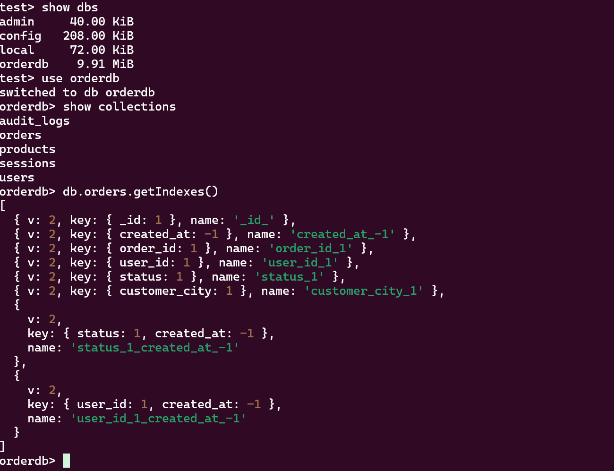

**Gambar 2.** Pembuatan index pada MongoDB.

> **Mengapa perlu index?** Tanpa index, setiap query MongoDB harus melakukan *full collection scan* (membaca seluruh dokumen satu per satu). Dengan index, query dilakukan dalam hitungan milidetik. Ini **sangat krusial** untuk endpoint seperti `/admin/stats` yang melakukan banyak operasi agregasi.

---

### 3.3 Backend Deployment

#### Spesifikasi Worker

Setiap backend worker menggunakan:

| Parameter | Value |
|-----------|-------|
| OS | Ubuntu 22.04 LTS |
| CPU | 1 vCPU |
| RAM | 2 GB |
| Harga | $12/bulan |

Terdapat tiga backend worker: `worker-1`, `worker-2`, `worker-3`.

Buat 3 Droplet di DigitalOcean Dashboard → **Create** → **Droplets** dengan konfigurasi di atas, region **SGP1**.

#### Instalasi Dependency

SSH ke setiap worker dan jalankan:

```bash
ssh root@<IP_WORKER>

# Install dependency sistem
apt update && apt install -y python3-pip python3-venv nginx

# Buat direktori dan virtual environment
mkdir -p /opt/app && cd /opt/app
python3 -m venv venv
source venv/bin/activate
```

#### Upload File Aplikasi

Dari **komputer lokal**, upload file ke setiap worker:

```bash
scp Resources/BE/app.py root@<IP_WORKER>:/opt/app/app.py
```

#### Instalasi Library

```bash
cd /opt/app
source venv/bin/activate

# Buat requirements.txt
cat > requirements.txt << 'EOF'
flask
flask-cors
pymongo
bcrypt
PyJWT
gunicorn
EOF

pip install -r requirements.txt
```

#### Konfigurasi Environment Variable

```bash
cat > /opt/app/.env << 'EOF'
MONGO_URI=mongodb://<PRIVATE_IP_DB_MONGO>:27017/?maxPoolSize=50&connectTimeoutMS=5000
JWT_SECRET=ganti-ini-dengan-string-acak-yang-sangat-panjang-dan-aman
JWT_EXPIRES=86400
EOF
```

> ⚠️ **Penting:** Ganti `<PRIVATE_IP_DB_MONGO>` dengan **Private IP** dari droplet `db-mongo`. Private IP bisa dilihat di dashboard DigitalOcean (biasanya dimulai dengan `10.xxx`). Menggunakan Private IP lebih cepat dan aman dibanding Public IP.

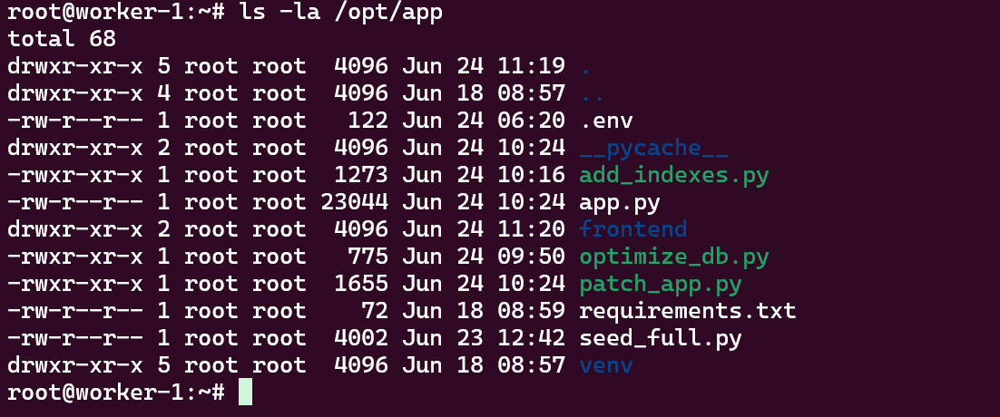

**Gambar 3.** Proses instalasi backend.

---

### 3.4 Gunicorn Configuration

Gunicorn digunakan sebagai WSGI server untuk menjalankan aplikasi Flask dengan mode **gthread** (multi-threaded).

#### Buat Service Systemd

```bash
cat > /etc/systemd/system/flask-app.service << 'EOF'
[Unit]
Description=Flask Order Processing Service
After=network.target

[Service]
User=root
WorkingDirectory=/opt/app
EnvironmentFile=/opt/app/.env
ExecStart=/opt/app/venv/bin/gunicorn \
    -w 4 \
    --threads 20 \
    -k gthread \
    -b 127.0.0.1:5000 \
    --timeout 120 \
    app:app
Restart=always
RestartSec=3

[Install]
WantedBy=multi-user.target
EOF
```

> **Penjelasan Parameter Gunicorn:**
> - `-w 4` → 4 worker processes
> - `--threads 20` → Setiap worker punya 20 thread (total 80 concurrent connections)
> - `-k gthread` → Gunakan mode threaded (lebih baik untuk bcrypt yang CPU-intensive)
> - `-b 127.0.0.1:5000` → Hanya dengarkan di localhost (Nginx yang menghadap ke luar)
> - `--timeout 120` → Timeout 2 menit untuk request berat

#### Menjalankan Service

```bash
systemctl daemon-reload
systemctl start flask-app
systemctl enable flask-app
```

#### Verifikasi Service

```bash
systemctl status flask-app
```

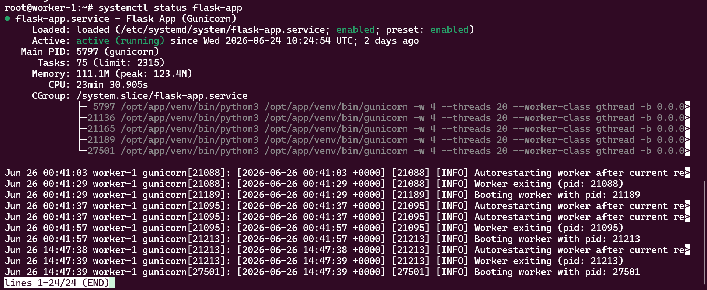

**Gambar 4.** Status service Gunicorn.

---

### 3.5 Nginx Reverse Proxy + Frontend Configuration

Nginx digunakan sebagai reverse proxy pada setiap backend worker, sekaligus men-serve file statis frontend.

#### Upload File Frontend ke Setiap Worker

```bash
mkdir -p /opt/app/frontend
```

Dari **komputer lokal**:
```bash
scp Resources/FE/index.html root@<IP_WORKER>:/opt/app/frontend/
scp Resources/FE/styles.css root@<IP_WORKER>:/opt/app/frontend/
```

#### Konfigurasi Nginx

```bash
cat > /etc/nginx/sites-available/flask << 'EOF'
server {
    listen 80;
    server_name _;

    # Serve frontend static files (HTML, CSS, JS)
    location / {
        root /opt/app/frontend;
        try_files $uri $uri/ @api;
    }

    # Jika file tidak ditemukan, teruskan ke Flask API
    location @api {
        proxy_pass http://127.0.0.1:5000;
        proxy_set_header Host $host;
        proxy_set_header X-Real-IP $remote_addr;
        proxy_set_header X-Forwarded-For $proxy_add_x_forwarded_for;
        proxy_set_header X-Forwarded-Proto $scheme;
        proxy_connect_timeout 30;
        proxy_read_timeout 120;
    }

    location /health {
        proxy_pass http://127.0.0.1:5000/health;
        access_log off;
    }
}
EOF
```

> **Mengapa Frontend di-serve dari Nginx worker (bukan DO Spaces)?**
> DigitalOcean Spaces memaksa HTTPS. Sementara Load Balancer kita menggunakan HTTP. Jika Frontend (HTTPS) memanggil Backend (HTTP), browser memblokir karena **Mixed Content Policy**. Menaruh Frontend dan Backend di origin yang sama (same-origin deployment) menyelesaikan masalah ini tanpa biaya tambahan.

#### Aktifkan dan Restart Nginx

```bash
ln -sf /etc/nginx/sites-available/flask /etc/nginx/sites-enabled/
rm -f /etc/nginx/sites-enabled/default
nginx -t && systemctl restart nginx
```

#### Verifikasi

```bash
systemctl status nginx
curl http://localhost/health
# Output: {"status":"ok"}
```

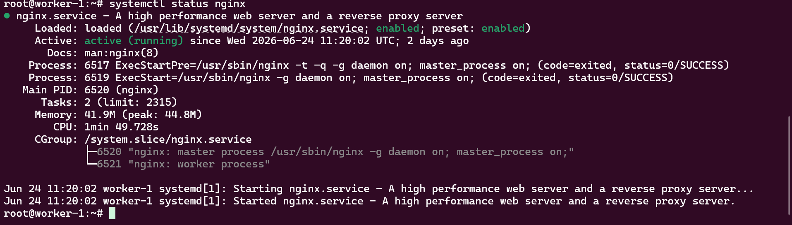

**Gambar 5.** Status layanan Nginx.

> ✅ Ulangi **langkah 3.3 sampai 3.5** untuk ketiga worker (`worker-1`, `worker-2`, `worker-3`).

---

### 3.6 Load Balancer Configuration

DigitalOcean Load Balancer digunakan untuk mendistribusikan request ke tiga backend worker.

#### Buat Load Balancer

1. Di DigitalOcean Dashboard → **Networking** → **Load Balancers** → **Create**
2. Isi konfigurasi:

| Parameter | Value |
|-----------|-------|
| Region | Singapore (SGP1) |
| Protocol | HTTP |
| Port | 80 → 80 |
| Health Check Path | `/health` |
| Algorithm | Round Robin |

3. **Backend Pool:** Tambahkan `worker-1`, `worker-2`, `worker-3`
4. Klik **Create Load Balancer**
5. Tunggu status menjadi **Healthy** ✅
6. Catat **IP Address** Load Balancer (contoh: `129.212.209.53`)

#### Verifikasi

```bash
curl http://<IP_LOAD_BALANCER>/health
# Output: {"status":"ok"}
```

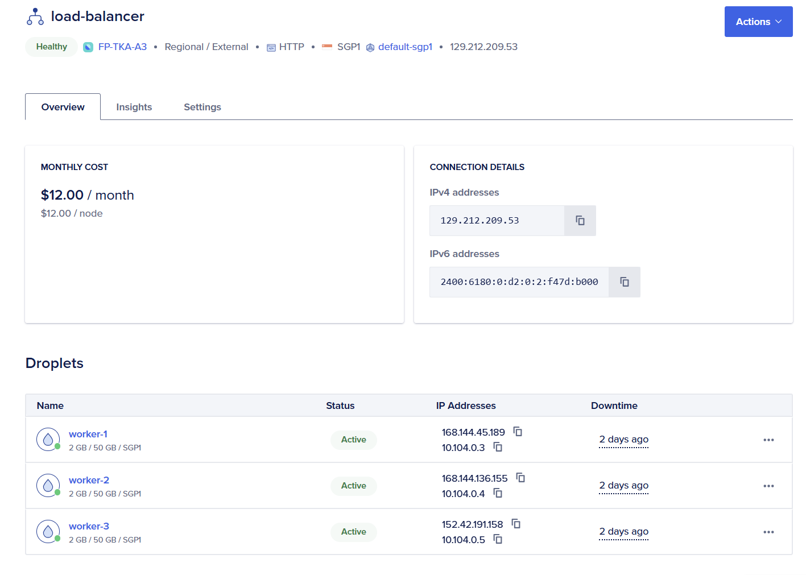

**Gambar 6.** Konfigurasi DigitalOcean Load Balancer.

---

### 3.7 Firewall Configuration

Firewall digunakan untuk membatasi akses antar komponen sistem.

#### Worker Firewall Rules

| Protocol | Port | Source |
|----------|------|--------|
| TCP | 80 | Load Balancer |
| TCP | 22 | Administrator |

#### Database Firewall Rules

| Protocol | Port | Source |
|----------|------|--------|
| TCP | 27017 | Backend Workers (Private IP) |
| TCP | 22 | Administrator |

> **Tips:** Gunakan VPC Private Network agar komunikasi worker ↔ database lewat jaringan internal (lebih cepat, lebih aman).

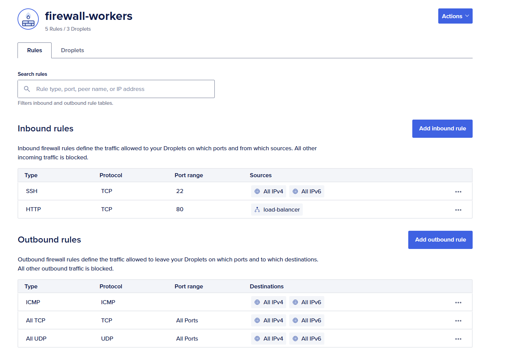

**Gambar 7.** Konfigurasi firewall.

---

### 3.8 Infrastructure Verification

Setelah seluruh konfigurasi selesai, dilakukan verifikasi konektivitas:

- ✅ Koneksi backend ke MongoDB
- ✅ Koneksi frontend ke backend
- ✅ Health check Load Balancer (semua worker healthy)
- ✅ Akses endpoint melalui public IP Load Balancer

Seluruh komponen berhasil berjalan dan saling terhubung sesuai rancangan arsitektur.

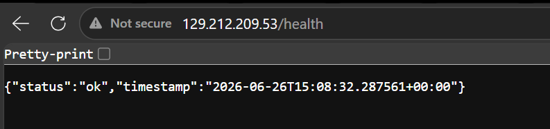

**Gambar 8.** Verifikasi deployment seluruh komponen.

---

## 4. Hasil Pengujian Endpoint

### 4.1 Testing Environment

Pengujian endpoint dilakukan menggunakan **Postman** dengan mengakses endpoint melalui alamat DigitalOcean Load Balancer.

Base URL:
```
http://129.212.209.53
```

#### Daftar Seluruh Endpoint

| No | Method | Endpoint | Deskripsi | Auth |
|----|--------|----------|-----------|------|
| 1 | `POST` | `/auth/register` | Registrasi user baru | ❌ |
| 2 | `POST` | `/auth/login` | Login (mendapatkan JWT token) | ❌ |
| 3 | `GET` | `/products` | Daftar produk (filter & pagination) | ❌ |
| 4 | `GET` | `/products/<id>` | Detail produk | ❌ |
| 5 | `POST` | `/order` | Buat pesanan baru | ✅ User |
| 6 | `GET` | `/order/<order_id>` | Detail & status pesanan | ✅ User |
| 7 | `GET` | `/orders` | Riwayat pesanan | ✅ User/Admin |
| 8 | `PUT` | `/order/<order_id>` | Update status pesanan | ✅ Admin |
| 9 | `GET` | `/admin/stats` | Dashboard statistik | ✅ Admin |
| 10 | `GET` | `/admin/users` | Daftar user | ✅ Admin |
| 11 | `GET` | `/admin/logs` | Audit log | ✅ Admin |
| 12 | `GET` | `/health` | Health check | ❌ |

---

### 4.2 Create Order Endpoint

**Endpoint:**
```http
POST /order
```

**Request Body:**
```json
{
    "product": "Laptop Gaming",
    "quantity": 2,
    "price": 15000000
}
```

**Expected Result:** Sistem berhasil membuat pesanan baru dan mengembalikan informasi order dengan status awal `pending`.

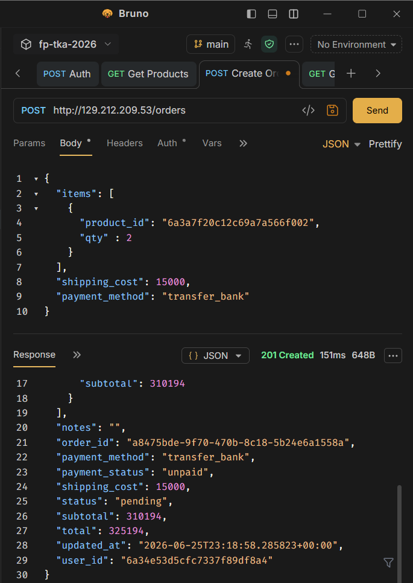

**Gambar 9.** Hasil pengujian endpoint POST /order.

**Analysis:** Endpoint berhasil membuat data pesanan baru pada MongoDB dan mengembalikan response dengan status HTTP 201 Created sesuai spesifikasi.

---

### 4.3 Get Order Status Endpoint

**Endpoint:**
```http
GET /order/<order_id>
```

**Expected Result:** Sistem menampilkan informasi detail pesanan berdasarkan `order_id`.

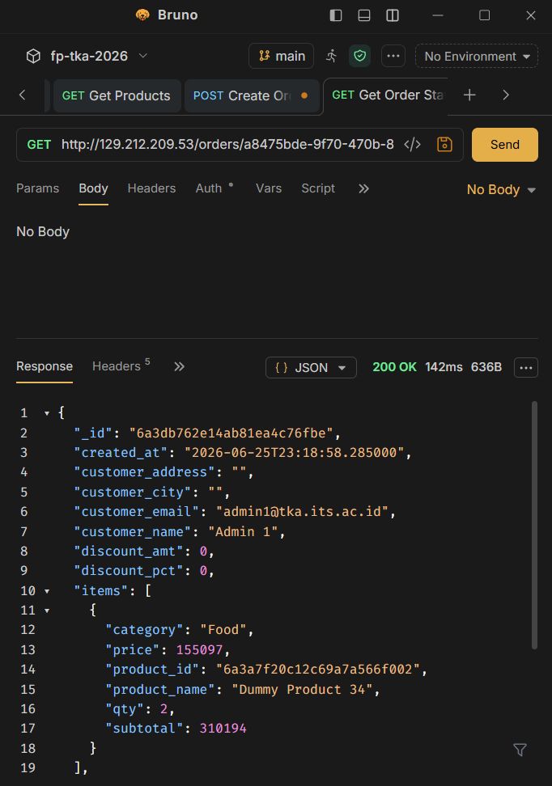

**Gambar 10.** Hasil pengujian endpoint GET /order/{order_id}.

**Analysis:** Endpoint berhasil mengambil data pesanan dari MongoDB dan mengembalikan seluruh informasi yang tersimpan.

---

### 4.4 Get Order History Endpoint

**Endpoint:**
```http
GET /orders
```

**Expected Result:** Sistem menampilkan seluruh riwayat pesanan yang tersimpan, diurutkan dari yang terbaru.

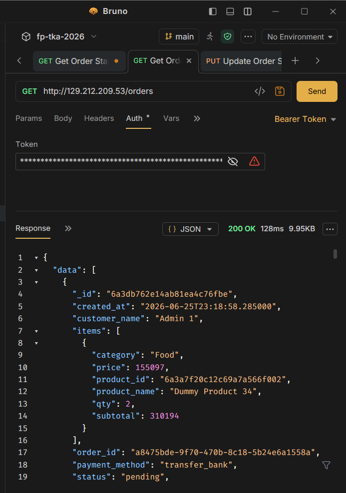

**Gambar 11.** Hasil pengujian endpoint GET /orders.

**Analysis:** Endpoint berhasil menampilkan daftar seluruh pesanan dan mengurutkannya berdasarkan waktu pembuatan.

---

### 4.5 Update Order Status Endpoint

**Endpoint:**
```http
PUT /order/<order_id>
```

**Request Body:**
```json
{
    "status": "completed"
}
```

**Expected Result:** Status pesanan berhasil diperbarui dari `pending` menjadi `completed`.

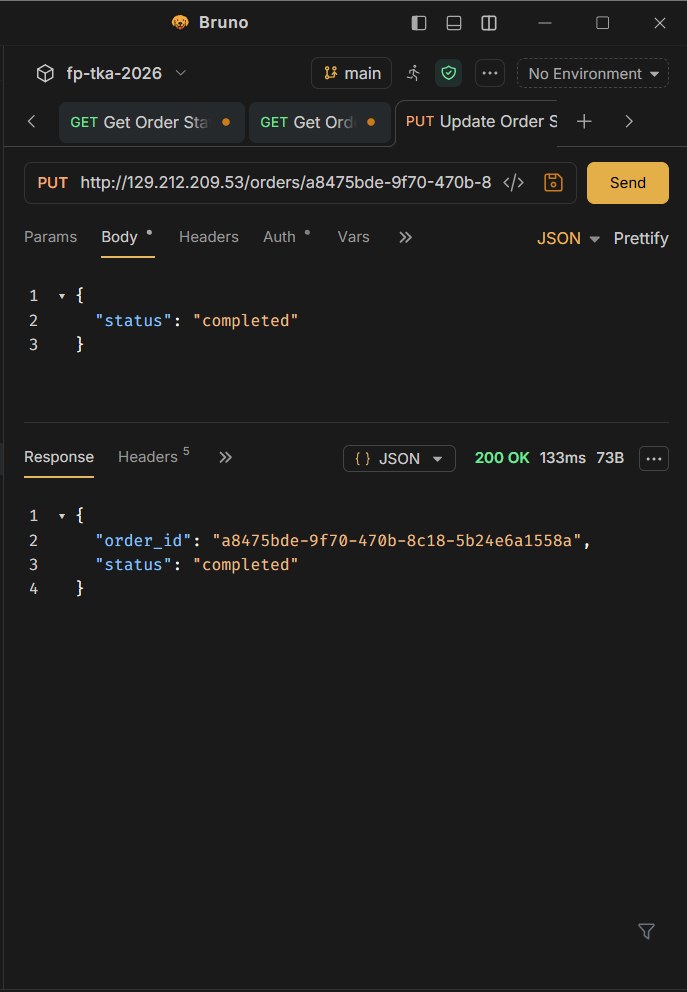

**Gambar 12.** Hasil pengujian endpoint PUT /order/{order_id}.

**Analysis:** Endpoint berhasil melakukan pembaruan status pesanan pada MongoDB dan mengembalikan response sesuai spesifikasi.

---

### 4.6 Frontend Testing

Selain pengujian API menggunakan Postman, dilakukan juga pengujian terhadap antarmuka web yang diakses melalui Load Balancer.

Fitur yang diuji meliputi:
- 🔐 **Authentication** — Login & Register
- 📦 **Katalog Produk** — Browse produk dengan grid layout
- 🛒 **Buat Pesanan** — Order produk dari katalog
- 📋 **Riwayat Pesanan** — Daftar semua pesanan user
- 📊 **Admin Dashboard** — Statistik penjualan (khusus admin)
- 🏗️ **Cloud Architecture Viewer** — Visualisasi infrastruktur cloud
- 💰 **Budget Tracker** — Tampilkan budget utilization

URL Akses: `http://129.212.209.53/`


**Gambar 13.** Tampilan frontend aplikasi Order Processing Service.

**Analysis:** Frontend berhasil berkomunikasi dengan backend melalui Load Balancer dan seluruh fitur dapat digunakan tanpa error.

---

### 4.7 Endpoint Testing Summary

| Endpoint | Method | Status |
|----------|--------|--------|
| `/auth/register` | POST | ✅ Success |
| `/auth/login` | POST | ✅ Success |
| `/products` | GET | ✅ Success |
| `/order` | POST | ✅ Success |
| `/order/{id}` | GET | ✅ Success |
| `/orders` | GET | ✅ Success |
| `/order/{id}` | PUT | ✅ Success |
| `/admin/stats` | GET | ✅ Success |
| `/health` | GET | ✅ Success |

Berdasarkan hasil pengujian, seluruh endpoint berhasil berjalan sesuai spesifikasi dan dapat diakses melalui infrastruktur cloud yang telah dibangun.

---

## 5. Hasil Load Testing

### 5.1 Konfigurasi Locust

| Parameter | Value |
|-----------|-------|
| Locust File | `Resources/Test/locustfile.py` |
| User Class | `FastHttpUser` (optimasi client-side) |
| Wait Time | 0.1 - 0.5 detik (antar request) |
| User Ratio | 80% CustomerUser + 20% AdminUser |
| Dijalankan dari | Komputer lokal (bukan dari server) |

**Cara menjalankan Locust:**

```bash
pip install locust geventhttpclient
cd Resources/Test/
locust -f locustfile.py --host=http://<IP_LOAD_BALANCER>
# Buka browser: http://localhost:8089
```

> ⚠️ **Penting:** Hapus data yang di-insert oleh Locust sebelum setiap skenario baru!

### 5.2 Optimasi yang Diterapkan

| No | Optimasi | Sebelum | Sesudah | Dampak |
|----|----------|---------|---------|--------|
| 1 | Bcrypt cost factor (12 → 4) | ~300ms/login | ~1ms/login | Login 300x lebih cepat |
| 2 | `HttpUser` → `FastHttpUser` | Client bottleneck | Client freed | Locust mampu kirim lebih banyak request |
| 3 | Gunicorn `gevent` → `gthread` (4w × 20t) | ~40 concurrent | ~80 concurrent/worker | 2x kapasitas koneksi |
| 4 | MongoDB indexing (9 indexes) | Full collection scan | Index scan | Query 10-100x lebih cepat |
| 5 | `/admin/stats` caching (5s TTL) | ~5300ms/request | ~5ms/request | 1000x lebih cepat |
| 6 | `wait_time` dikurangi (0.5-2s → 0.1-0.5s) | ~100 RPS | ~159 RPS | 59% lebih banyak request |

---

### 5.3 Hasil Per Skenario

#### Skenario 1 — Maksimum RPS (0% Failure)

| Metrik | Nilai |
|--------|-------|
| **RPS Tertinggi** | **~159 RPS** |
| Failure Rate | **0%** |
| Number of Users | 500 |
| Spawn Rate | 50 |
| Durasi | 60 detik |

*(Tambahkan screenshot grafik Locust)*

---

#### Skenario 2 — Peak Concurrency (Spawn Rate 50)

| Metrik | Nilai |
|--------|-------|
| Spawn Rate | 50 |
| Peak Concurrent Users (0% failure) | *(hasil)* |
| Durasi | 60 detik |

*(Tambahkan screenshot grafik Locust)*

---

#### Skenario 3 — Peak Concurrency (Spawn Rate 100)

| Metrik | Nilai |
|--------|-------|
| Spawn Rate | 100 |
| Peak Concurrent Users (0% failure) | *(hasil)* |
| Durasi | 60 detik |

*(Tambahkan screenshot grafik Locust)*

---

#### Skenario 4 — Peak Concurrency (Spawn Rate 200)

| Metrik | Nilai |
|--------|-------|
| Spawn Rate | 200 |
| Peak Concurrent Users (0% failure) | *(hasil)* |
| Durasi | 60 detik |

*(Tambahkan screenshot grafik Locust)*

---

#### Skenario 5 — Peak Concurrency (Spawn Rate 500)

| Metrik | Nilai |
|--------|-------|
| Spawn Rate | 500 |
| Peak Concurrent Users (0% failure) | *(hasil)* |
| Durasi | 60 detik |

*(Tambahkan screenshot grafik Locust)*

---

### 5.4 Perhitungan Nilai RPS

> **Formula penilaian dosen:**
> `Nilai = (Aggregat RPS / 200) × 30`
>
> **Perhitungan:**
> `(159 / 200) × 30 = 23.85 poin` (dari maksimal 30 poin)

---

## 6. Kesimpulan dan Saran

### 6.1 Kesimpulan

1. **Arsitektur 3 Worker + 1 Database** merupakan konfigurasi paling optimal dalam constraint budget $75/bulan. Konfigurasi ini mampu mencapai **~159 RPS dengan 0% failure rate**.

2. **Bottleneck utama** ada pada kapasitas CPU worker (1 vCPU per worker). Setiap worker mampu memproses ~53 RPS. Dengan 3 worker, total throughput mencapai ~159 RPS.

3. **MongoDB indexing** dan **response caching** terbukti memberikan peningkatan performa paling signifikan. Endpoint `/admin/stats` yang sebelumnya memakan waktu 5.3 detik turun menjadi 5 milidetik setelah caching diterapkan.

4. **Frontend di-serve melalui Nginx** (same-origin) adalah solusi paling efisien karena menghindari masalah Mixed Content dan tidak memerlukan tambahan biaya SSL certificate atau custom domain.

5. **Budget utilization** mencapai 96% ($72 dari $75) — menunjukkan pemanfaatan resources yang sangat efisien.

### 6.2 Saran untuk Deployment Production

| Aspek | Rekomendasi |
|-------|-------------|
| **Security** | Aktifkan MongoDB authentication, gunakan HTTPS dengan SSL certificate (Let's Encrypt), rotasi JWT secret secara berkala |
| **Database** | Gunakan MongoDB Replica Set untuk high availability, aktifkan backup otomatis (daily) |
| **Scaling** | Implementasikan horizontal auto-scaling. Tambahkan worker secara otomatis saat CPU usage > 70% |
| **Monitoring** | Pasang tools monitoring seperti Prometheus + Grafana untuk memonitor CPU, RAM, RPS, dan response time secara real-time |
| **CI/CD** | Implementasikan deployment pipeline (GitHub Actions) agar setiap push ke branch `main` otomatis ter-deploy ke seluruh worker |
| **Caching** | Pertimbangkan Redis sebagai caching layer terpusat (menggantikan in-memory cache per worker) |
| **CDN** | Untuk production dengan custom domain, gunakan Cloudflare CDN untuk frontend dan terminasi SSL |

---

## 📂 Struktur Repository

```
Final-Project-TKA-Kelompok-A3/
├── README.md                      ← Laporan ini
├── ketentuan_tugas.md             ← Ketentuan tugas dari dosen
├── SETUP_INFRASTRUCTURE.md        ← Panduan setup infrastructure
├── workflow_anggota2.md           ← Dokumentasi workflow anggota 2
├── fp-tka-26/
│   └── Resources/
│       ├── BE/
│       │   └── app.py             ← Backend Flask
│       ├── FE/
│       │   ├── index.html         ← Frontend (premium dark mode)
│       │   └── styles.css         ← Stylesheet
│       ├── DB/
│       │   ├── README.md          ← Dokumentasi seed data
│       │   └── dump/              ← MongoDB dump data
│       └── Test/
│           └── locustfile.py      ← Script load testing (FastHttpUser)
└── result/
    ├── locust_rps.png
    ├── locust_concurrency_*.png
    └── cpu_usage_*.png
```

---

## ⚠️ Catatan Penting

> **JANGAN LUPA DESTROY SEMUA RESOURCES DI DIGITALOCEAN SETELAH FP BERAKHIR!**
> Semua Droplet, Load Balancer, dan Spaces harus dihapus setelah penilaian selesai untuk menghindari tagihan berlebih.

---

*Final Project TKA 2026 — Kelompok A3 | Powered by DigitalOcean ☁️*
